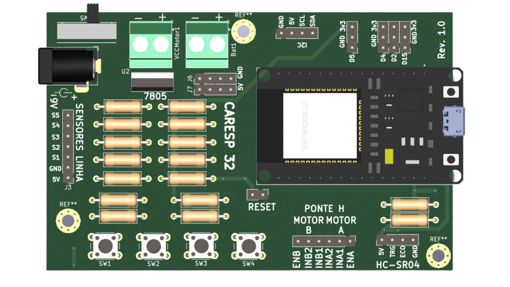

# SeriesCarEsp32
Coleção de software para placa CarESP32

CarEsp32 é uma placa shield para ESP32 Deve Kit v1 30 pinos

* Pinos
  * Sensor de Linha  
SL1 - 16  
SL2 - 17  
SL3 - 18  
SL4 - 19  
SL5 - 23

  * Chaves  
SW1 - 35  
SW2 - 36  
SW3 - 39  
SW4 - 34  

# Exemplos

* [Exemplos Blutooth](BLECARESP32/README.md)
  

